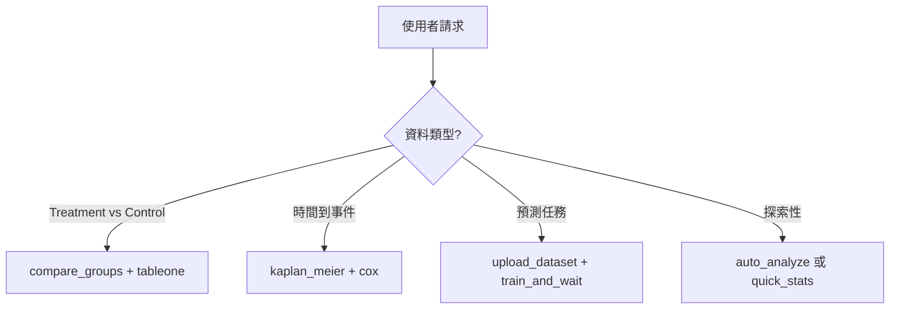

# 003 - MCP 工具流程改善計畫

> Created: 2025-12-16
> Status: Proposal

## 🎯 背景

經過 `medical_study_200.csv` 完整測試流程後，發現 Agent 在執行時需要多次提醒與修改，主要問題如下：

### 觀察到的問題

| # | 問題 | 影響 | 頻率 |
|---|------|------|------|
| 1 | Host/Container 路徑混淆 | 工具調用失敗 | 🔴 每次 |
| 2 | 98+ 工具選擇困難 | 效率低、用錯工具 | 🟡 常見 |
| 3 | user_id 重複輸入 | 繁瑣 | 🟡 每次 |
| 4 | Result ID 管理分散 | 難以追溯 | 🟡 常見 |
| 5 | 缺少流程整合工具 | 需手動串接 | 🟡 常見 |
| 6 | 缺失值處理不一致 | auto_analyze 失敗 | 🟢 偶發 |

---

## 💡 改善方案比較

### 方案 A: 強化 AGENTS.md + Skills (低成本)

**做法：**
1. 在 AGENTS.md 加入「MCP 路徑速查表」
2. 在 Skills 加入「工具決策樹」
3. 新增 `mcp-quick-start` Skill

**優點：** 不改程式碼，立即生效
**缺點：** 仍需 Agent 記住規則

```markdown
## 📍 MCP 路徑速查 (AGENTS.md 新增)

| 情境 | 使用路徑 | 範例 |
|------|----------|------|
| MCP 工具 csv_path | `/data/...` | `/data/sample_data/iris.csv` |
| MCP 工具 output_path | `/data/projects/...` | `/data/projects/study1/clean.csv` |
| 本機讀取檔案 | `/home/eric/...` | `read_file(...)` |
| 建立專案目錄 | `projects/...` | 在 workspace 下建立 |
```

---

### 方案 B: MCP Tools 整併 (中成本)

**做法：**
1. 新增 `smart_analyze` 整合工具
2. 新增 `analyze_with_report` 一鍵分析
3. 部分工具轉為 Resource（唯讀資訊）

**新增工具：**

```python
# 1. smart_analyze - 智能分析（整合多個工具）
mcp_automl_smart_analyze(
    csv_path: str,           # 只需 CSV 路徑
    analysis_types: list = ["basic", "tableone", "correlation"],
    group_column: str = None,
    user_id: str = "default"  # 有預設值
) -> {
    "quick_stats": {...},
    "tableone": {...},
    "correlations": {...},
    "report_path": "...",    # 自動生成報告
    "result_ids": [...]      # 所有結果 ID
}

# 2. complete_medical_study - 醫學研究完整流程
mcp_automl_complete_medical_study(
    csv_path: str,
    treatment_column: str,
    outcome_column: str,
    covariates: list = None,  # 自動偵測
    user_id: str = "default"
) -> {
    "tableone": {...},
    "treatment_effect": {...},
    "propensity_analysis": {...},  # 如果適用
    "report_path": "..."
}
```

**轉為 Resource（唯讀）：**
- `list_algorithms` → Resource: `automl://algorithms`
- `list_available_files` → Resource: `automl://files/{directory}`
- `get_upload_help` → Resource: `automl://help/upload`
- `health_check` → Resource: `automl://health`

---

### 方案 C: 新增 Agent-Specific Skill (中成本)

**做法：**
建立 `mcp-workflow-agent` Skill，內含完整決策邏輯

```yaml
---
name: mcp-workflow-agent
description: Autonomous MCP workflow executor that handles path conversion,
tool selection, and result aggregation automatically. Use when running any
MCP data analysis task. Triggers: 分析, analyze, MCP, 資料處理.
---

# MCP Workflow Agent

## 自動路徑轉換規則
1. 使用者說 `sample_data/xxx.csv` → 自動轉 `/data/sample_data/xxx.csv`
2. 使用者說 `專案 X 的資料` → 檢查 `/data/projects/X/`
3. 輸出一律存 `/data/projects/{project_name}/`

## 工具選擇決策樹


## 失敗回退邏輯
- auto_analyze 失敗 → 拆分成 get_quick_stats + generate_tableone_directly
- upload_dataset 失敗 → 檢查路徑，嘗試 list_available_files
```

---

### 方案 D: MCP Server 端改進 (高成本)

**做法：**
1. Server 端實現路徑自動轉換
2. 新增 Session 機制（記住 user_id）
3. 實現 Workflow 引擎

**Server 端新增：**

```python
# 1. 路徑自動解析
@app.middleware
def auto_resolve_path(request):
    if "csv_path" in request:
        path = request["csv_path"]
        if not path.startswith("/data/"):
            # 自動嘗試多個位置
            for prefix in ["/data/sample_data/", "/data/projects/"]:
                if os.path.exists(prefix + path):
                    request["csv_path"] = prefix + path
                    break
    return request

# 2. Session 管理
class SessionManager:
    def __init__(self):
        self.sessions = {}  # session_id -> {user_id, project, results}

    def get_user_id(self, session_id):
        return self.sessions.get(session_id, {}).get("user_id", "default")

# 3. Workflow 引擎
@mcp.tool
async def run_workflow(
    workflow_type: str,  # "eda", "medical_study", "ml_training"
    csv_path: str,
    config: dict = {}
) -> dict:
    """執行預定義的工作流程"""
    workflows = {
        "eda": [get_quick_stats, auto_analyze, generate_report],
        "medical_study": [tableone, compare_groups, correlations, report],
        "ml_training": [upload, train, leaderboard, predict]
    }
    results = {}
    for step in workflows[workflow_type]:
        results[step.__name__] = await step(csv_path, **config)
    return results
```

---

## 🎯 建議執行順序

| 優先級 | 方案 | 時間 | 影響範圍 |
|--------|------|------|----------|
| P0 | A: AGENTS.md 強化 | 1-2hr | 僅文檔 |
| P1 | C: 新增 workflow Skill | 2-4hr | 僅 Skill |
| P2 | B: 整併工具 | 1-2 day | MCP Server |
| P3 | D: Server 端改進 | 3-5 day | 全面 |

---

## 📋 P0: AGENTS.md 立即更新內容

### 新增章節：MCP 工具使用指南

```markdown
## 🔧 MCP 工具使用指南

### 路徑規則（最重要！）

**黃金規則：MCP 工具的 csv_path 永遠用 `/data/` 開頭**

| 使用者輸入 | 正確轉換 |
|------------|----------|
| `iris.csv` | `/data/sample_data/iris.csv` |
| `sample_data/xxx.csv` | `/data/sample_data/xxx.csv` |
| `專案 A 的資料` | `/data/projects/A/data.csv` |
| `/home/eric/.../xxx.csv` | `/data/sample_data/xxx.csv` 或 `/data/projects/.../xxx.csv` |

### 工具選擇速查

| 使用者說... | 使用工具 |
|-------------|----------|
| 「看看資料」「有什麼欄位」 | `get_quick_stats` + `direct_preview_data` |
| 「分析這個資料」 | `generate_tableone_directly` (推薦) 或 `auto_analyze` |
| 「比較兩組」「治療效果」 | `compare_groups` |
| 「相關性」「變數關係」 | `analyze_correlations` |
| 「訓練模型」「預測」 | `upload_dataset` → `train_and_wait` |
| 「存活分析」「KM 曲線」 | `kaplan_meier_survival` |
| 「傾向分數」「PSM」 | `run_propensity_analysis` |
| 「ROC」「AUC」 | `compute_roc_curve` |

### 預設 user_id

**除非使用者指定，一律使用 `user_id="eric"`**

### 結果追蹤

每次分析完成後，記錄到專案的 `analysis_log.md`：
- Result ID
- MinIO 路徑
- 時間戳
```

---

## 📋 P1: 新增 `mcp-quick-analysis` Skill

建立 `.claude/skills/mcp-quick-analysis/SKILL.md`：

```yaml
---
name: mcp-quick-analysis
description: Streamlined MCP analysis workflow with automatic path conversion
and tool selection. Executes complete analysis pipeline with minimal user input.
Use when user wants quick data analysis without specifying individual tools.
Triggers: 快速分析, quick analysis, 分析一下, 看資料, 幫我分析.
---

# Quick Analysis Workflow

## 標準執行順序

1. **確認檔案** (1 步驟)
   - `list_available_files` 確認檔案存在
   - 轉換為 `/data/...` 路徑

2. **快速概覽** (1 步驟)
   - `get_quick_stats` 取得基本資訊

3. **主要分析** (依需求選擇)
   - 有分組欄位 → `generate_tableone_directly`
   - 要比較數值 → `compare_groups`
   - 要看相關性 → `analyze_correlations`

4. **記錄結果**
   - 建立 `reports/analysis_YYYYMMDD.md`
   - 列出所有 Result IDs

## 自動路徑轉換

```python
def convert_path(user_path):
    if user_path.startswith("/data/"):
        return user_path
    if "sample_data" in user_path:
        return f"/data/sample_data/{Path(user_path).name}"
    if "projects" in user_path:
        return f"/data/projects/{'/'.join(user_path.split('projects/')[-1:])}"
    # 預設嘗試 sample_data
    return f"/data/sample_data/{Path(user_path).name}"
```
```

---

## ✅ 決議

請選擇要執行的方案：

- [ ] P0: 立即更新 AGENTS.md（建議先做）
- [ ] P1: 新增 mcp-quick-analysis Skill
- [ ] P2: 整併 MCP Tools（需修改 Server）
- [ ] P3: Server 端全面改進

---

## 📝 附錄：測試中遇到的具體問題

### 問題 1: auto_analyze 失敗
```
Error: '<' not supported between instances of 'NoneType' and 'float'
```
**原因：** 資料有缺失值（hdl_cholesterol: 10, hba1c: 6, education: 4）
**解法：** 改用 `generate_tableone_directly`（較 robust）

### 問題 2: 路徑錯誤
```python
# Agent 一開始用了 Host 路徑
csv_path="/home/eric/workspace251204/sample_data/medical_study_200.csv"

# 需要提醒改成
csv_path="/data/sample_data/medical_study_200.csv"
```

### 問題 3: user_id 忘記
```python
# 多個工具都需要 user_id
upload_dataset(..., user_id="eric")
train_and_wait(..., user_id="eric")
list_analysis_results(user_id="eric")
```

### 問題 4: 結果分散
```
Table One → stat_tableone_68fa8190
Compare   → stat_compare_groups_3526f788
Corr      → stat_correlation_68edb133
ML        → Job 79f76242-811f-48c1-9080-172af4efd45e
```
需要手動整理到報告中。
